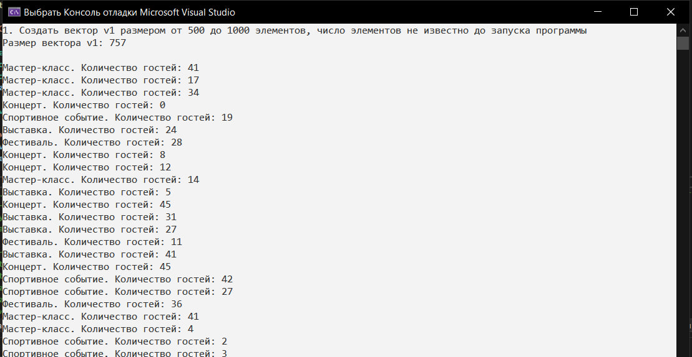
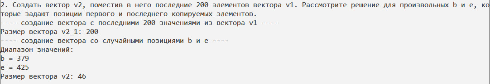
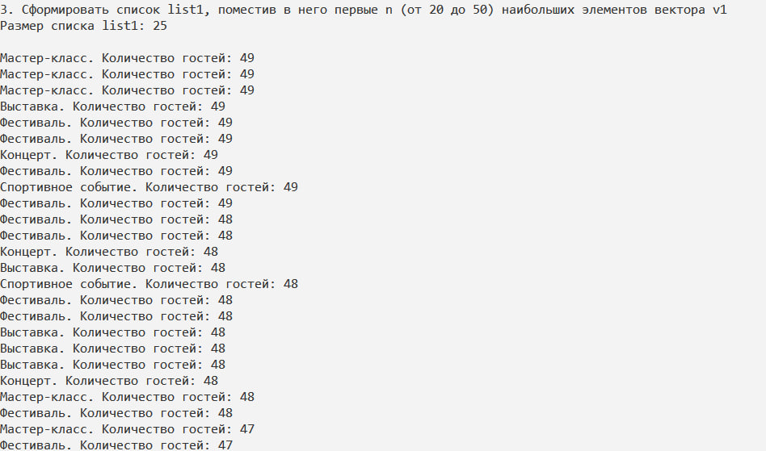
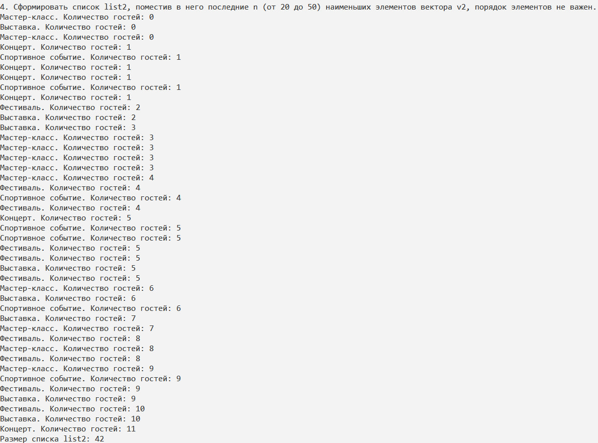
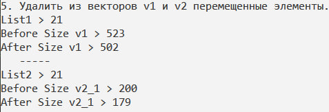
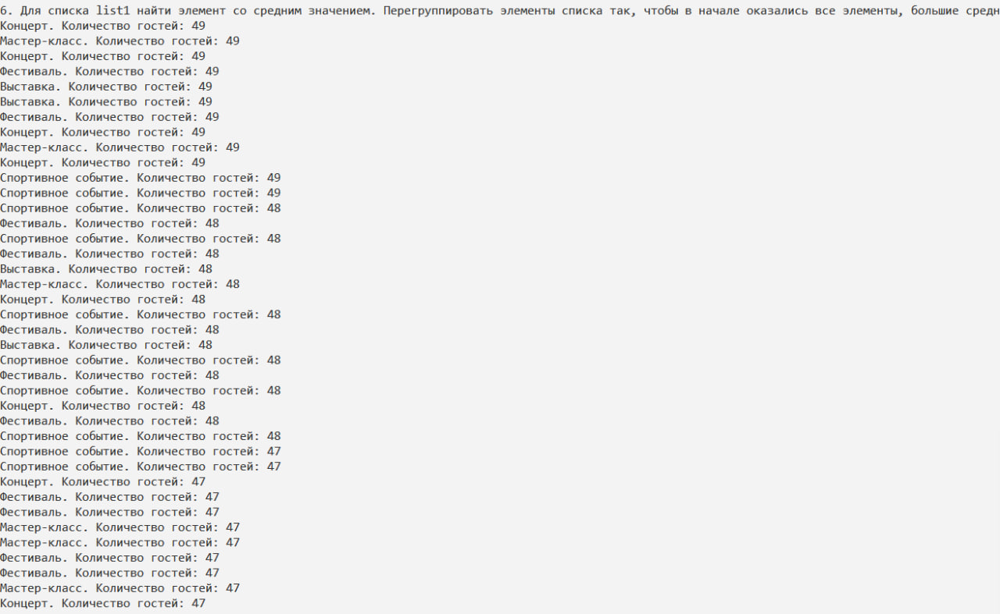
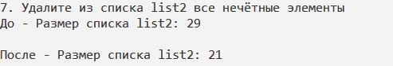
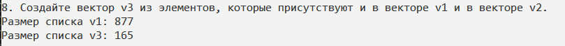
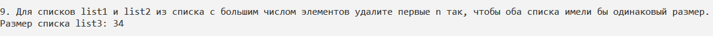
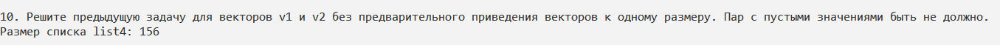

МИНИСТЕРСТВО НАУКИ И ВЫСШЕГО ОБРАЗОВАНИЯ РОССИСКОЙ ФЕДЕРАЦИИ

Федеральное государственное автономное образовательное учреждение высшего образования «Национальный исследовательский университет ИТМО» (НИУ ИТМО)

Факультет программной инженерии и компьютерной техники 


# Отчет по Лабораторной №3 по дисциплине "Программирование на С++"

***Работу выполнила: Люкина Д. С.***

***Группа: P4119***

***Преподаватель: Лаздин А.В.***

--------

***Задача***

Задание состоит из последовательности связанных между собой пунктов.

1. Создать вектор v1 размером от 500 до 1000 элементов, число элементов не известно до запуска программы. Элементами вектора являются экземпляры класса из Л.Р. №2 имеющие произвольные(случайные) значения. В случае необходимости этот класс должен быть доработан для возможности решать поставленные в этой ЛР задачи.

2. Создать вектор v2, поместив в него последние 200 элементов вектора v1. Рассмотрите решение для произвольных b и e, которые задают позиции первого и последнего копируемых элементов.
3. Сформировать список list1, поместив в него первые n (от 20 до 50) наибольших элементов вектора v1 (указанные элементы должны быть отсортированы до помещения их в список).
4. Сформировать список list2, поместив в него последние n (от 20 до 50) наименьших элементов вектора v2, порядок элементов не важен.
5. Удалить из векторов v1 и v2 перемещенные элементы. Скорректируйте размеры векторов после удаления из них элементов.
6. Для списка list1 найти элемент со средним значением. Перегруппировать элементы списка так, чтобы в начале оказались все элементы, большие среднего значения.
7. Удалите из списка list2 все нечётные элементы (или используйте другой критерий, который однозначно делит экземпляры вашего класса на два непересекающихся множества).
8. Создайте вектор v3 из элементов, которые присутствуют и в векторе v1 и в векторе v2.
9. Для списков list1 и list2 из списка с большим числом элементов удалите первые n так, чтобы оба списка имели бы одинаковый размер. Сформируйте из них список list3, который будет хранить пары <первый элемент списка list1, первый элемент списка list2>, <второй элемент списка list1, второй элемент списка list2>  и т. д.
10. Решите предыдущую задачу для векторов v1 и v2 без предварительного приведения векторов к одному размеру. Пар с пустыми значениями быть не должно.

***Решение***

1. **Создать вектор v1 размером от 500 до 1000 элементов, число элементов не известно до запуска программы. Элементами вектора являются экземпляры класса из Л.Р. №2 имеющие произвольные(случайные) значения. В случае необходимости этот класс должен быть доработан для возможности решать поставленные в этой ЛР задачи.**

```
random_device rd;
default_random_engine engine(rd());
uniform_int_distribution<int> sizeDist(500, 1000);
int vectorSize = sizeDist(engine);

vector<CityEvent> v1(vectorSize);

cout << "Размер вектора v1: " << v1.size() << "\n\n";
```
С учетом того, что мы работаем с классом из ЛР 2, его пришлось создать, так как при 
создании экземпляров класса внутри вектора как раз подключается в работу обычный конструктор 
без каких-либо параметров. 

Создан был он таким образом, что в нем все свойства выбираются в случайном порядке.

```
CityEvent::CityEvent() {
	static const std::string names[] = { 
		"Концерт", "Фестиваль", "Выставка", "Мастер-класс", "Спортивное событие"
	};
	static const std::string descriptions[] = { 
		"Увлекательный концерт известной группы.",
		"Присоединяйтесь к празднику искусств.",
		"Выставка современных художников.",
		"Мастер-класс по рукоделию.",
		"Спортивные соревнования чемпионата."
	};
	static const std::vector<std::string> topicsList = { "Музыка", "Искусство", "Спорт", "Образование", "Культура" };

	std::random_device rd;
	std::default_random_engine engine(rd());
	std::uniform_int_distribution<int> nameDist(0, sizeof(names) / sizeof(names[0]) - 1);
	std::uniform_int_distribution<int> descrDist(0, sizeof(descriptions) / sizeof(descriptions[0]) - 1);
	std::uniform_int_distribution<int> topicDist(0, topicsList.size() - 1);

	name = names[nameDist(engine)];
	description = descriptions[descrDist(engine)];
	topics.push_back(topicsList[topicDist(engine)]);

	generateRandomVisitors(rand() % 50);
}

// генерирует данные гостей
void CityEvent::generateRandomVisitors(int size) {
	std::vector<std::string> visitorNames = { "Алина", "Борис", "Скарлетт", "Давид", "Ева", "Анжелла" };
	std::vector<std::string> visitorSurname = { "Йохансон", "Сноу", "Поттер", "Грейнджер", "Уизли", "Дамблдор" };

	std::random_device rd;
	std::default_random_engine engine(rd());
	std::uniform_int_distribution<int> visitorNamesDist(0, visitorNames.size() - 1);
	std::uniform_int_distribution<int> visitorSurnameDist(0, visitorSurname.size() - 1);
	std::uniform_int_distribution<int> number(100000, 300000);

	for (int i = 0; i < size; i++) {
		visitors.push_back({ 
			visitorNames[visitorNamesDist(engine)],
			visitorSurname[visitorSurnameDist(engine)],
			std::to_string(number(engine))
			});
	}
}
```

Результат:


2. **Создать вектор v2, поместив в него последние 200 элементов вектора v1. Рассмотрите решение для произвольных b и e, которые задают позиции первого и последнего копируемых элементов.**

По заданию реализовала и создание вектора с последними данными из вектора v1, а также создание вектора, получив в случайном порядке позиции b и e, ограничив разве что b диапазонами от 0 до 400, а e - c 401 до конца размера вектора v1.

```
cout << "2. Создать вектор v2, поместив в него последние 200 элементов вектора v1. Рассмотрите решение для произвольных b и e, которые задают позиции первого и последнего копируемых элементов.\n";
cout << "---- создание вектора с последними 200 значениями из вектора v1 ----\n";
vector<CityEvent> v2_1(v1.end() - 200, v1.end());
cout << "Размер вектора v2_1: " << v2_1.size() << "\n";

cout << "---- создание вектора со случайными позициями b и e ----\n";
uniform_int_distribution<int> sizeDist_b(0, 400);
uniform_int_distribution<int> sizeDist_e(401, v1.size());
int b = sizeDist_b(engine);
int e = sizeDist_e(engine);
cout << "Диапазон значений:\n";
cout << "b = " << b << '\n';
cout << "e = " << e << '\n';

vector<CityEvent> v2_2(v1.begin() + b, v1.begin() + e);
cout << "Размер вектора v2: " << v2_2.size() << "\n\n";
```

Результат:


по выводу в консоли по второму заданию можно увидеть, что в первом случае количество элементов, как и задумывалось, получилось 200, а во втором уже меньше, так как позиции b и e в коде выбираются рандомно.

3. **Сформировать список list1, поместив в него первые n (от 20 до 50) наибольших элементов вектора v1 (указанные элементы должны быть отсортированы до помещения их в список).**

Элементы поместила в list1 из v1 путем сортировки. Параметром сортировки является количество зарегистрированных посетителей на мероприятие. Количество загружаемых в list1 из v1 также генерируется случайно от 20 до 50.

```
cout << "3. Сформировать список list1, поместив в него первые n (от 20 до 50) наибольших элементов вектора v1\n";

int n = rand() % 31 + 20;
// сортируем по количеству зарегистрированных на мероприятие по убыванию
sort(v1.begin(), v1.end(), [](CityEvent& a, CityEvent& b) {
    return a.getVisitors().size() > b.getVisitors().size();
});

list<CityEvent> list1(v1.begin(), v1.begin() + n);
```

Результат:

Видно, что мероприятия выводятся от большого количества посетителей к меньшему, и они являются самыми загруженными из всех остальных из вектора v1.

4. **Сформировать список list2, поместив в него последние n (от 20 до 50) наименьших элементов вектора v2, порядок элементов не важен.**

Здесь применен немного другой способ. Элементы из v2_1 копируются в список, сортируются в порядке убывания количества посетителей в экземплярах, а с помощью метода erase количество элементов в списке обрезается до нужного количества.

```
cout << "4. Сформировать список list2, поместив в него последние n (от 20 до 50) наименьших элементов вектора v2, порядок элементов не важен.\n";
list<CityEvent> list2(v2_1.begin(), v2_1.end());
list2.sort([](CityEvent& a, CityEvent& b) {
    return a.getVisitors().size() < b.getVisitors().size();
});
list2.erase(next(list2.begin(), n), list2.end());
```

Результат:


5. **Удалить из векторов v1 и v2 перемещенные элементы. Скорректируйте размеры векторов после удаления из них элементов.**

Для удаления перемещенных в list1 и list2 элементов из вектора, необходимо было дополнить методы класса перегрезкой оператора сравнения.

```
bool CityEvent::operator==(const CityEvent& cityEvent) {
	if (visitors.size() == cityEvent.visitors.size()) {
		for (int i = 0; i < visitors.size(); i++) {
			if (visitors[i].name != cityEvent.visitors[i].name &&
				visitors[i].phone != cityEvent.visitors[i].phone &&
				visitors[i].surname != cityEvent.visitors[i].surname) {
				return false;
			}
		}
		if (topics.size() == cityEvent.topics.size()) {
			for (int i = 0; i < topics.size(); i++) {
				if (topics[i] != cityEvent.topics[i]) {
					return false;
				}
			}
			return name == cityEvent.name && description == cityEvent.description;
		}
		else {
			return false;
		}
	}
	else {
		return false;
	}
}
```
- remove_if: Эта функция принимает три аргумента: начало и конец контейнера, а также лямбда-функцию, которая определяет условие для удаления.
- &list1: Это захват списка list1 по ссылке, чтобы можно было использовать его внутри лямбда-функции
.
Внутри лямбда-функции:
- const CityEvent& e: Переменная e представляет каждый элемент в v1 в процессе прохода.
- find(list1.begin(), list1.end(), e): Эта функция ищет элемент e в контейнере list1. Если элемент найден (т.е. find возвращает итератор, не равный list1.end()), то условие возвращает true, что означает, что данный элемент следует удалить из v1.
- v1.erase(...): Удаляет все элементы, которые соответствуют условиям, и обновляет контейнер v1 путем удаления лишних элементов, которые были "помечены" для удаления

Аналогично будет с вектором v2_1 и со списком list2.

```
cout << "5. Удалить из векторов v1 и v2 перемещенные элементы.\n";
cout << "List1 > " << list1.size() << "\n";
cout << "Before Size v1 > " << v1.size() << "\n";
v1.erase(remove_if(v1.begin(), v1.end(), [&list1](const CityEvent& e) {
    return find(list1.begin(), list1.end(), e) != list1.end();
    }), v1.end());
cout << "After Size v1 > " << v1.size() << "\n";
cout << "   -----   \n";
cout << "List2 > " << list2.size() << "\n";
cout << "Before Size v2_1 > " << v2_1.size() << "\n";
v2_1.erase(remove_if(v2_1.begin(), v2_1.end(), [&list2](const CityEvent& e) {
    return find(list2.begin(), list2.end(), e) != list2.end();
    }), v2_1.end());
cout << "After Size v2_1 > " << v2_1.size() << "\n\n";
```

Результат:




6. **Для списка list1 найти элемент со средним значением. Перегруппировать элементы списка так, чтобы в начале оказались все элементы, большие среднего значения.**

Здесь делаем следующим образом: применяем функцию accumulate от #include <\algorithm>, которая возвращает общую сумму всех посетителей во всех мероприятиях из list1, а с помощью деления на общий размер списка list1 получаем среднее значение. И далее используем функцию partition, которая перераспределит элементы list1 так, что те элементы, которые соответствуют заданному условию, будут находиться в первой части контейнера, а остальные — во второй части.

```
cout << "6. Для списка list1 найти элемент со средним значением. Перегруппировать элементы списка так, чтобы в начале оказались все элементы, большие среднего значения\n";
double average = accumulate(list1.begin(), list1.end(), 0.0,
    [](double sum, CityEvent& event) {
        return sum + event.getVisitors().size();
    }) / list1.size();

auto it = partition(list1.begin(), list1.end(),
    [average](CityEvent& a) {
        return a.getVisitors().size() > average; // Условие для элементов в первой половине
    });
```

Результат:



7. **Удалите из списка list2 все нечётные элементы (или используйте другой критерий, который однозначно делит экземпляры вашего класса на два непересекающихся множества).**

В случае класса с мероприятиями критерием будет являться название, и удален из списка будет тот, который называется "Концерт".

```
list2.remove_if([](CityEvent& event) { return event.getName() == "Концерт"; });
```

Результат:



8. **Создайте вектор v3 из элементов, которые присутствуют и в векторе v1 и в векторе v2.**

Применяем функцию set_intersection, которая предназначена для нахождения пересечения двух 
отсортированных диапазонов.

```
sort(v1.begin(), v1.end(), [](CityEvent& a, CityEvent& b) {
    return a.getVisitors().size() < b.getVisitors().size();
    });
sort(v2_1.begin(), v2_1.end(), [](CityEvent& a, CityEvent& b) {
    return a.getVisitors().size() < b.getVisitors().size();
    });
vector<CityEvent> v3; // Копируем v1 в v3
set_intersection(v1.begin(), v1.end(), v2_1.begin(), v2_1.end(), back_inserter(v3));
cout << "Размер списка v1: " << v1.size() << "\n";
cout << "Размер списка v3: " << v3.size() << "\n\n";
```
Результат:



9. **Для списков list1 и list2 из списка с большим числом элементов удалите первые n так, чтобы оба списка имели бы одинаковый размер. Сформируйте из них список list3, который будет хранить пары <первый элемент списка list1, первый элемент списка list2>, <второй элемент списка list1, второй элемент списка list2>  и т. д.**

```
cout << "9. Для списков list1 и list2 из списка с большим числом элементов удалите первые n так, чтобы оба списка имели бы одинаковый размер.\n";
if (list1.size() > list2.size()) {
    auto it_l = list1.begin();
    advance(it_l, list1.size() - list2.size());
    list1.erase(list1.begin(), it_l);
}
else {
    auto it_l = list2.begin();
    advance(it_l, list2.size() - list1.size());
    list2.erase(list2.begin(), it_l);
}

list<pair<CityEvent, CityEvent>> list3;
transform(list1.begin(), list1.end(), list2.begin(), std::back_inserter(list3), [](auto o1, auto o2)
    { return std::make_pair(o1, o2); });

cout << "Размер списка list3: " << list3.size() << "\n\n";
```

Результат:



10. **Решите предыдущую задачу для векторов v1 и v2 без предварительного приведения векторов к одному размеру. Пар с пустыми значениями быть не должно.**

```
cout << "10. Решите предыдущую задачу для векторов v1 и v2 без предварительного приведения векторов к одному размеру. Пар с пустыми значениями быть не должно.\n";
list<pair<CityEvent, CityEvent>> list4;
transform(v1.begin(), v1.begin() + min(v1.size(), v2_1.size()), v2_1.begin(), back_inserter(list4), [](auto o1, auto o2)
	{ return make_pair(o1, o2); });
cout << "Размер списка list4: " << list4.size() << endl;
```

Решение:

