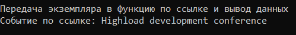

МИНИСТЕРСТВО НАУКИ И ВЫСШЕГО ОБРАЗОВАНИЯ РОССИСКОЙ ФЕДЕРАЦИИ

Федеральное государственное автономное образовательное учреждение высшего образования «Национальный исследовательский университет ИТМО» (НИУ ИТМО)

Факультет программной инженерии и компьютерной техники 

# Отчет по Лабораторной №2 по дисциплине "Программирование на С++"

***Работу выполнила: Люкина Д. С.***

***Группа: P4119***

***Преподаватель: Лаздин А.В.***

--------

***Задача***

Необходимо спроектировать класс, реализующий хранение данных, связанных с экземпляром класса в динамической памяти. 

***Условия***

Для данного класса необходимо реализовать все необходимые конструкторы, включая конструкторы копирования и перемещения, деструктор. Все конструкторы и деструктор должны «сообщать» о своём вызове. std::cout << “Copy constructor” << std::endl; то же относится и к перегрузке операции присваивания (два варианта: без перемещения и с перемещением). 
Определение класса должно быть помещено в заголовочный файл (.hpp), реализация методов в отдельном файле .cpp.

Написать программу (ещё один модуль cpp) осуществляющую работу с экземплярами разработанного класса, которая должна демонстрировать:
создание статических и динамических экземпляра класса, стандартного вектора в стиле Си, написать функцию для обработки данного вектора;
передача экземпляров класса в функцию, и возврат экземпляра из функции; включая вариант с передачей и возвратом значений типа ссылки на класс;
продемонстрировать работу с разработанным классом, создавая вектора и списки экземпляров класса, используя стандартные классы vector и list длиной от 5 до 10.

***Описание класса и его методов***

Класс CityEvent - представляет собой тип данных для хранения информации о мероприятии и управлении данных внутри нее.

Имеются следующие свойства:
- string name - название мероприятия
- string description - описание мероприятия
- vector <string> topics - список из главных тем
- vector <Person> visitors - список зарегистрированных пользователей

Person - это структура для хранения данных человека со свойствами name, surname, phone

Класс предоставляет возможность создания экземпляра класса с помощью: 
- стандартного конструктора с условием записи сразу с информацией названия, описания мероприятия и основными темами, регистрация посетителей будет осуществляться с помощью других методов
- конструктора копирования
- конструктора перемещения

Геттеры (для возможности получения данных из экземпляра, так как свойства приватные): 
- getName - получение названия мероприятия
- getDescription - получение описания мероприятия
- getTopics - получение основных тем мероприятия
- getVisitors - получение зарегистрировавшихся на мероприятие людей

Методы класса:
- updateName - обновление названия мероприятия
- updateDescription - обновление описания мероприятия
- updateTopics - обновление основных тем мероприятия

Методы класса для работы с вектором из зарегистрировавшихся:
- registrNewVisitor - добавление в вектор человека, с условием, что человека с таким номером телефона еще нет
- updateDataVisitor - обновление данных человека в векторе, найдя его по телефону и изменив конкретное свойство в структуре человека
- deleteVisitor - удаление человека по телефону из зарегистрировавшихся;
- isThereOnRegistry - проверка человека в списке зарегистрировавшихся.

Также реализованы перегрузка опереатора с перемещением и без:
- CityEvent& operator=(const CityEvent& cityEvent);
- CityEvent& operator=(CityEvent&& cityEvent) noexcept.

***Результат работы кода и описание результатов***

Демонстрация работы всех конструкторов, методов и перегрузок:

Демонстрация создания экземпляров класса и хранение их в векторе:

Что видим: после создания непосредственно самого экземпляра, при добавлении его в вектор с помощью push_back, срабатывает конструктор копирования, тогда как при добавлении данных с помощью emplace_back срабатывают сразу и конструтор копирования и перемещения. Это из-за того, что emplace_back создан для того, чтобы непосредственно передавать данные для экземпляра, но в примере кода передан непосредственно экземпляр, поэтому срабатывают сразу два конструтора и деструктор к одному из них.

Демонстрация передачи экземпляров в функцию без ссылок и указателей:

Что видим: в функцию передаются только копии экземпляров, соответственно срабытывает конструктор копирования и деструктор, и эта копия существует только в рамках функции. Количество конструкторов и деструкторов создается столько, сколько их было в векторе.

Демонстрация создания динамического экземпляра, и возврат его по ссылке из функции:

Что видим: экземпляр создается один раз без использования конструторов копирования

То же самое происходит, если в качестве параметра передать функции экземпляр. Никаких конструкторов копирования и перемещения, данные в экземпляре можно изменять внутри функции.

При перечислении в цикле также срабатывает конструтор копирования.

В конце программы обязательно срабатывает деструтор всех недеактивированных классов.